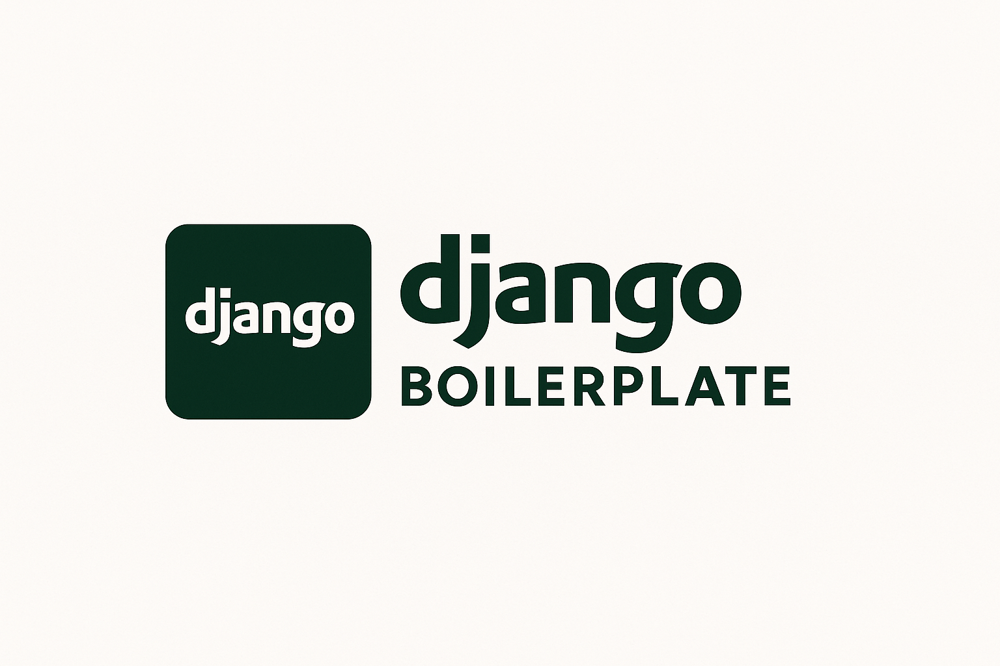

<div align="center">
  

# Django Boilerplate

[](https://github.com/S4NKALP/django-biolerplate/graphs/contributors)
[](https://github.com/S4NKALP/django-biolerplate/stargazers)
[](https://github.com/S4NKALP/django-biolerplate/network/members)
[](https://github.com/S4NKALP/django-biolerplate/watchers)
[](https://github.com/S4NKALP/django-biolerplate/pulse)

</div>

---

<strong>**Django Boilerplate** is a **production-ready starter kit** packed with modern tools and best practices to help developers
build scalable, maintainable, and feature-rich Django applications faster.</strong>

<p align="center">
  <a href="https://github.com/S4NKALP/django-biolerplate/wiki">Documentation</a>
  ·
  <a href="https://github.com/S4NKALP/django-biolerplate/issues">Report a Bug</a>
  ·
  <a href="https://github.com/S4NKALP/django-biolerplate/issues">Request a Feature</a>
</p>

<br>

## Overview

**Django Boilerplate Generator** is a modern CLI tool that creates Django projects with a production-ready boilerplate template. Unlike traditional Django starters, this tool allows you to **select only the features you need**, making it perfect for both minimal projects and feature-rich applications.

## Features

### 🎯 **Modular Feature Selection**

Choose from 9+ optional features:

- **Django REST Framework** - Build powerful APIs
- **API Documentation (drf-yasg)** - Auto-generated Swagger docs
- **CORS Headers** - Cross-origin resource sharing
- **WhiteNoise** - Static file serving in production
- **Django Jazzmin** - Modern admin interface
- **Database URL Support** - Easy database configuration
- **Email Configuration** - Production email setup
- **Production Security** - SSL, HSTS, and security headers
- **Django Environ** - Environment variable management

### 🚀 **Smart Dependencies**

- Automatic dependency resolution (e.g., API docs automatically includes DRF)
- Only installs what you need
- Clean, minimal requirements.txt

### ⚙️ **Production Ready**

- Environment-based settings (development/production)
- Security best practices
- Static file handling
- Database flexibility

## Installation

```bash
pip install django-boilerplate-generator
```

Or install from source:

```bash
git clone https://github.com/S4NKALP/django-biolerplate.git
cd django-biolerplate
pip install -e .
```

## Usage

### Interactive Mode

```bash
django-boilerplate
# Follow the prompts to select features
```

This provides a true checkbox interface with arrow key navigation and space bar toggling.

### Command Line Options

```bash
# List all available features
django-boilerplate --list-features

# Create minimal Django project (no extra features)
django-boilerplate --minimal --project myproject --app myapp

# Select specific features
django-boilerplate --features drf cors whitenoise --project myproject --app myapp

# Include all features
django-boilerplate --all-features --project myproject --app myapp

# Initialize Git repository
django-boilerplate --project myproject --app myapp --git
```

### Available Features

```bash
django-boilerplate --list-features
```

### Examples

**Minimal Django project:**

```bash
django-boilerplate --minimal --project blog --app posts
```

**API-focused project:**

```bash
django-boilerplate --features drf api_docs cors --project api --app core
```

**Full-featured project:**

```bash
django-boilerplate --all-features --project myapp --app main --git
```

---

To use this template, follow these steps:

1. [Fork the repository](https://github.com/S4NKALP/README-Templates/fork).
2. Clone the forked repository to your local environment.
3. Make the necessary changes and modifications.
4. Commit and push your changes.
5. Create a pull request to the original repository.
